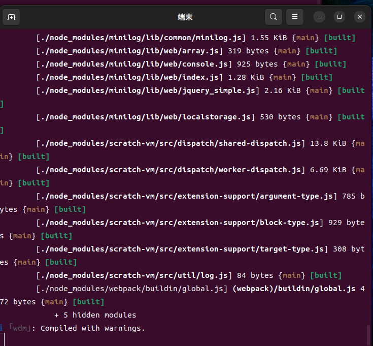
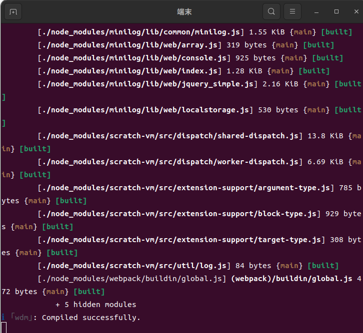
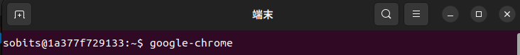
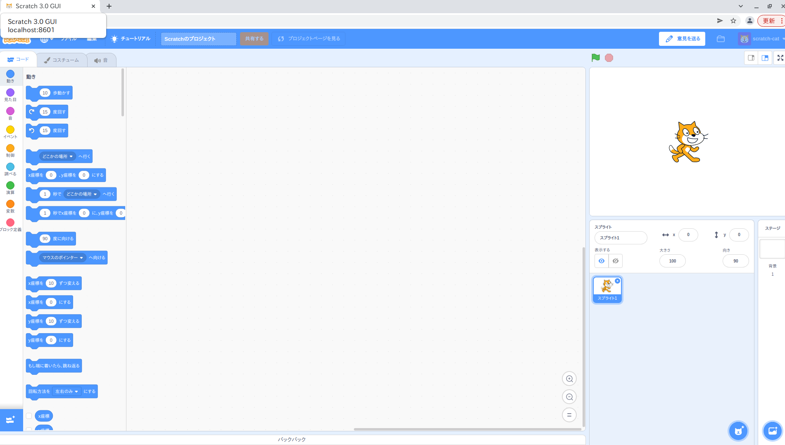

# prost_scratch_env

Scratchで新たなブロック作成等を行えるリポジトリです。（主にプロスタ用）
これはJavascriptを使用して、scratchからrosに通信を行うためのブロックを作成することができます。
<br><br>

## How to Use
dockerでの開発をおすすめします。
[docker環境](https://github.com/Choi-Laboratory/scratch_ws)

以下の３つのリポジトリをクローンして、npmをインストールし、guiにリンクしてください。[choi laboratory](https://github.com/Choi-Laboratory)にあります。
```
git clone https://github.com/Choi-Laboratory/scratch-vm.git
cd scratch-vm
npm install
sudo npm link
```
```
git clone https://github.com/Choi-Laboratory/scratch-blocks.git
cd scratch-blocks
npm install 
sudo npm link
```
```
git clone https://github.com/Choi-Laboratory/scratch-gui.git
cd scratch-gui
npm link scratch-vm scratch-blocks
npm install
```

※npm startをする前に2箇所の変更が必要です。

① /src/components/alerts/inline-message.cssを編集する。

```
    .inline-message {
    color: $ui-white;
    font-family: "Helvetica Neue", Helvetica, Arial, sans-serif;
    display: flex;
    justify-content: flex-end;  //endをflex-endに変更する。
    align-items: center;
    font-size: .8125rem;
}
```
② /src/components/menu-bar/author-info.css 
```
    .author-info {
    color: $ui-white;
    font-family: "Helvetica Neue", Helvetica, Arial, sans-serif;
    display: flex;
    justify-content: flex-start;
    align-items: center;
    cursor: default;
}
```

```
npm start
```

#### ここで以下のようになれば、正しくnpmが起動できていません。
<br>



#### 以下のようになれば、正しくnpmが起動できています。
<br>

<br>
<br>

ここまでできればローカル[http://localhost:8601/ ](http://localhost:8601/ )でscratchを編集することができます。（deployしない限り、授業のscratchには更新されません。）

※Dockerを使用している場合、Docker上でgoogle-chromeを開かないと動かないので注意してください。

<br>
以下のように開くことができれば成功です。（少し時間がかります。）
<br>


<br>

## Publishing to Scratch data
以下の順序を進めると、授業で使用しているscratchにdeployすることができます。
授業用と開発用があるので、注意して下さい
※これをするためには権限が必要になります。その時のプロスタの責任者に確認してみてください。
①授業用（学生が使用しているプラットフォームです。触るのは慎重に）
```
npm run build
npm run deploy
```
①開発用（こいつは壊してもOK用）
```
npm run build
npm run deploy -- -e test
```

## Create a Oridinal Block
初年次プロジェクト・プロジェクトスタディーズでオリジナルブロックを作成したい場合は以下の２つのファイルを使用します。（src/extensions/scratch3_turtlebot）
```
index.js
web_video_viewer.js
```

